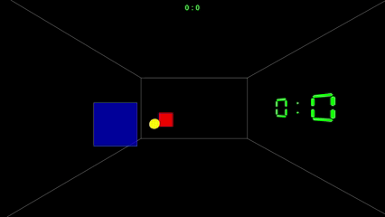

# 3D Pong

## Beschreibung
Ein Einzelspieler 3D-Pong in Java Swing, inspiriert von klassischen Pong-Spielen,
aber mit einer modernen selbstentwickelten perspektivischen 3D-Grafik. Das Ziel ist es, den Ball am gegnerischen Paddle vorbeizubringen.


## Technische Highlights
- **Kollisionserkennung**: Findet jeden Tick zwischen definierten Objekten durch ein Hitboxsystem statt.
- **Eigene 3D-Engine**: Die 3-dimensionalen Eckpunkte der Objekte werden per Transformationsmatrizen und perspektivischer Projektion auf eine 2-dimensionale Ebene projiziert.
- **Update-Logik**: Ein Swing-Timer sorgt für regelmäßige Updates der Spielszene, einschließlich Bewegung, Kollisionserkennung und Soundwiedergabe.

## Projektstruktur
| Klasse           | Beschreibung                                                               |
|------------------|----------------------------------------------------------------------------|
| `BoxHitbox`      | Quaderförmige Hitbox zur Kollisionserkennung                               |
| `Matrix4x4`      | 4×4-Matrix für Transformationsberechnungen                                 |
| `Vektor3`        | 3-dimensionaler Vektor für Geschwindigkeit und Position                    |
| `Entity`         | Oberklasse aller Objekte, besteht aus einem `Transform` und einem `Mesh`   |
| `Mesh`           | Oberklasse für konkrete Formen wie `RectangleMesh` oder `EllipseMesh`      |
| `Transform`      | Speichert Rotation, Position und Skalierung als `Vektor3`                  |
| `RenderPipeline` | Transformiert eine `Entity` so, dass sie projiziert werden kann            |
| `Drawer`         | Zeichnet die projizierten Eckdaten auf das Panel                           |
| `GameScene`      | Koordiniert und speichert die Spieldaten                                   |
| `SceneManager`   | Koordiniert zwischen den verschiedenen Szenen (Menü, Spiel, Einstellungen) |
| `SoundManager`   | Steuert die Soundwiedergabe                                                |

## Voraussetzungen & Installation

### Spielen (JAR)
1. Java 23 oder höher installieren
2. [JAR-Datei von GitHub herunterladen](https://github.com/JJ2102/Pong/releases/download/v1.0/Pong.jar)
3. JAR-Datei mit Doppelklick oder über die Kommandozeile ausführen:
   ```bash
   java -jar Pong.jar
   ```

### Entwicklung (Quellcode)
1. Repository klonen:
   ```bash
   git clone https://github.com/JJ2102/Pong.git
    ```
2. Projekt in einer Java-IDE (z.B. IntelliJ IDEA, Eclipse) öffnen
3. `src`-Ordner als Quellcode-Verzeichnis markieren
4. `res`-Ordner als Ressourcen-Verzeichnis markieren
5. `Game.java` als Einstiegspunkt festlegen und ausführen

## Autor
GitHub: [@JJ2102](https://github.com/JJ2102)